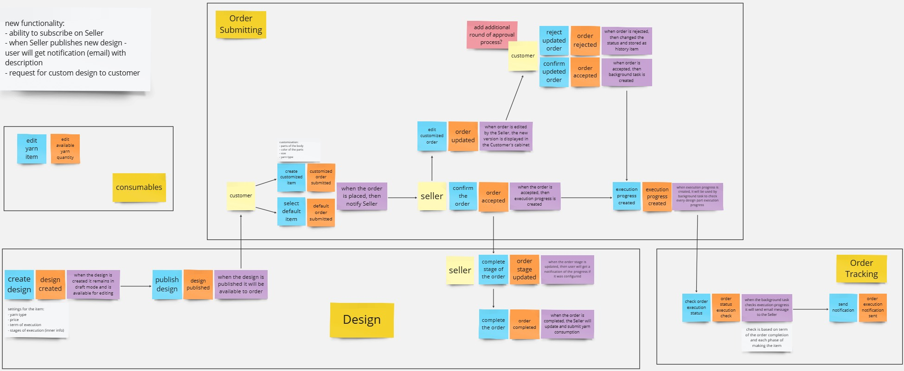
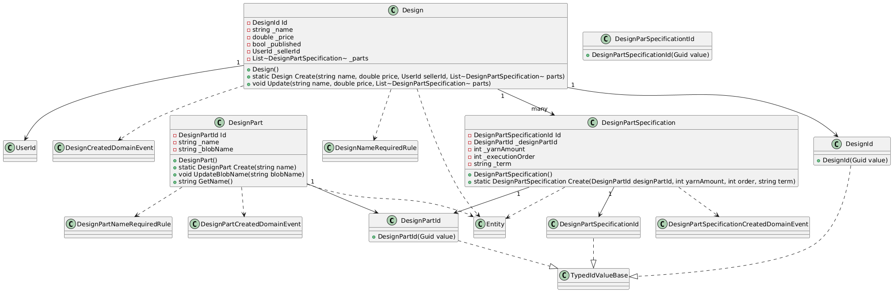
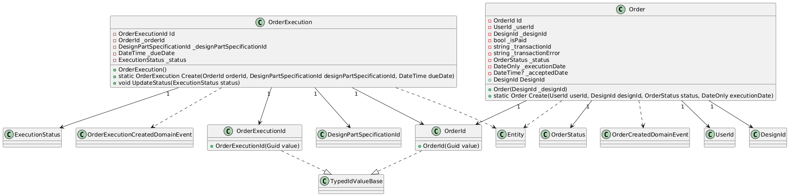
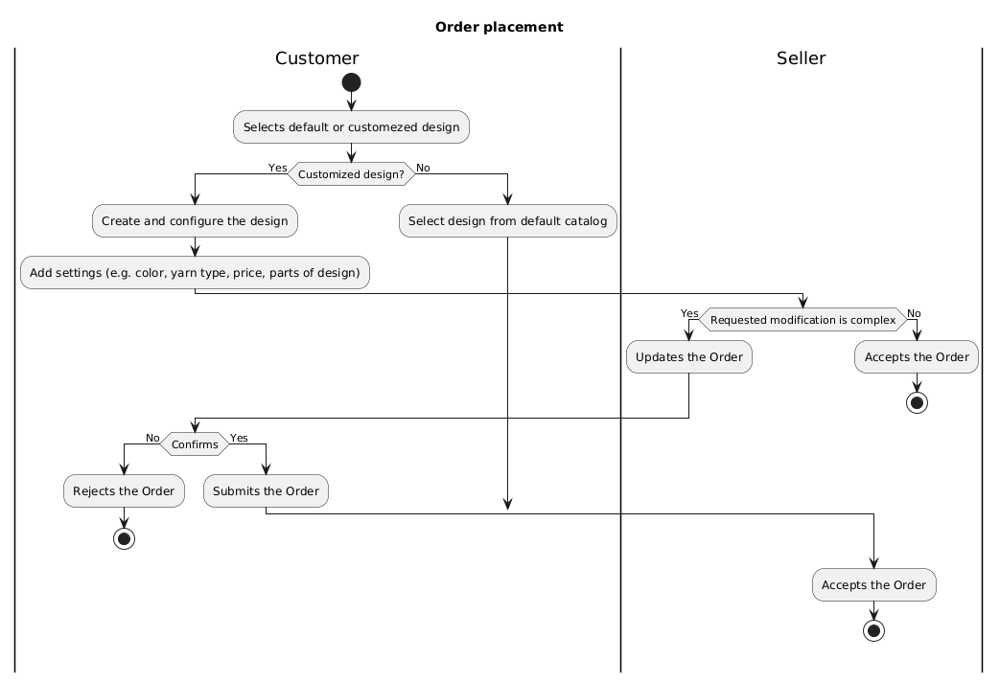
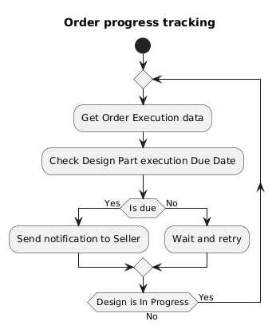

# Yarnique
Yarnique is a web app designed to help crafters efficiently manage their yarn stash and projects. Whether you’re working on a large knitting project or just organizing your stash, Yarnique streamlines the process with easy-to-use features designed specifically for yarn lovers.

# Domain Description

**Designs**

`Design` is one of the main business entities. `Design` can by created only by a `User` who has been assigned the `Seller` role.

Each `Design` consist of several `Design Part` and its `Specifications`.

`Design Part Specification` describes amount of yarn used to create the part and `Term` of execution. `Design Part Specifications` also have an `Execution Order`.

The `Seller` can add a new `Design Part` if it is necessary for the `Design`.

Once the `Design` is customized, it can be published and made available for ordering.

**Order Submitting**

A brand new copy of the `Design` is created in the `Order` module module schema when the `Design` is published. It can be ordered by a `User`.

For a new `Order`, a new `Execution Progress` will be created for each `Design Part Specification`, that reflects `Due Date` and `Status` of execution. The `Due Date` for `Design Part Specification` is calculated based on the `Acceptance` date and the `Order` and `Term` and `Execution Order`

`Seller` can update the execution progress of the `Design Part Specification` and the `Order`.

**Order Tracking**

Implemented as `IHostedService`. `Background Service` checks each `Order` that has a status of `Accepted` or `In Progress`.

The execution of the `Order` is tracked by the `Background Service` and in case execution of `Design Part` does not meet `Due Date`, an `Email Notification` will be sent to the `Seller` once per day.

**User Management**

`User` can register in the application. There are three main roles: `Administrator`, `Seller` and `Customer`.

Each `Role` can be assigned or reassigned to a `User` by an `Administrator`.

Depending on the `Role`, `User` can access certain parts and actions of the application.


Module that is not implemented yet

**Consumables**

Each design part has a specification which describes a `Yarn` used for that particular piece: its `Color`, `Type` and `Producer`. `Administrator` or `Seller` should be able to track, add and edit available yarns


# Event Storming
Event Storming technique was used to develop the application. Below is a diagram of the main business processes


# Class Diagrams




# Activity Diagrams




# Getting started
1. Clone the Repository
```
git clone https://github.com/Yuliya-Shcherbak/Yarnique.git
cd Yarnique
```
2. Set up Database
- Create DB named Yarnique
- Update connection string in `Yarnique.Database.Migrations` project and run.
3. Run the Application
